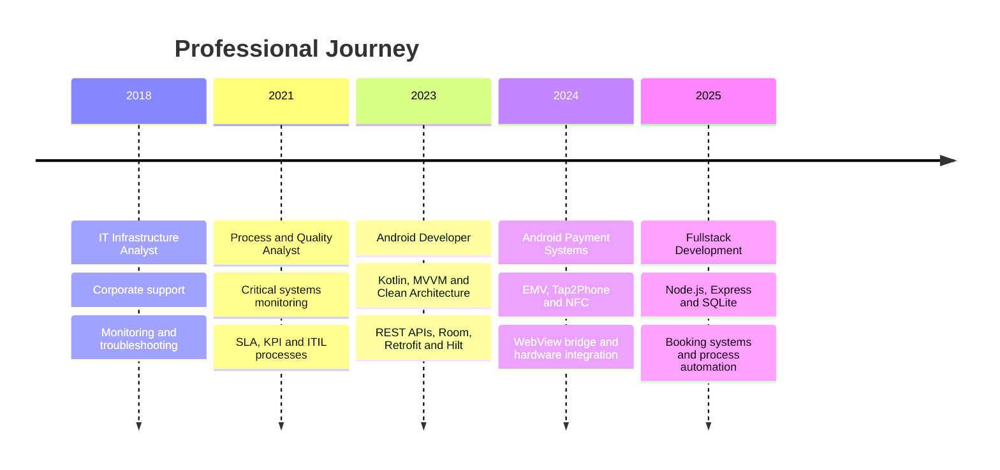
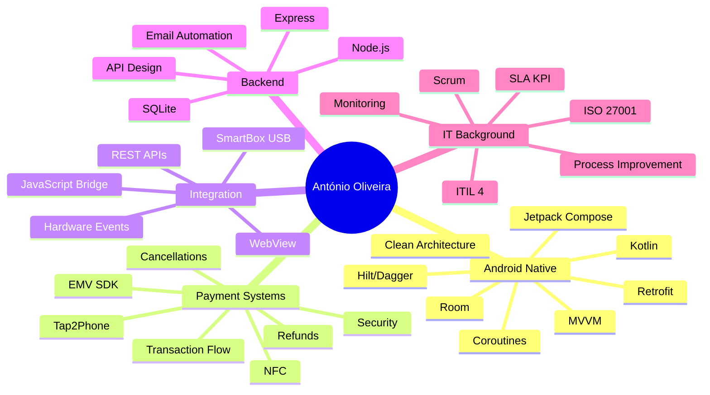

<div align="center">
  
</div>

<br>

<div align="center">
  
  [](https://git.io/typing-svg)

</div>

<br>

<div align="center">
  <a href="https://www.linkedin.com/in/id-antonio-felipe">
    
  </a>
  <a href="mailto:afelipe.pt@outlook.com">
    
  </a>
  <a href="https://github.com/afoliveira111">
    
  </a>
  
</div>

<br>

---

<br>

## 👨‍💻 About Me

<table>
<tr>
<td width="50%">

```kotlin
data class Developer(
    val name: String = "António Felipe Aguiar de Oliveira",
    val role: String = "Android Developer",
    val location: String = "Coimbra, Portugal 🇵🇹",
    val experience: String = "3+ years Android | 15+ years IT",
    val specialization: List<String> = listOf(
        "Native Android with Kotlin",
        "EMV/Tap2Phone Payments",
        "Hardware Integration",
        "WebView & JavaScript Bridge",
        "Backend APIs with Node.js"
    ),
    val currentFocus: String = "Secure mobile and payment solutions",
    val philosophy: String = "Security, stability and real business impact"
)
```

</td>
<td width="50%">

### 🎯 Core Expertise

- 📱 **Android Native**: Kotlin, MVVM, Clean Architecture
- 💳 **EMV Payments**: Tap2Phone, NFC, Wizzit/Unicre SDK
- 🔌 **Hardware**: SmartBox/USB, device communication
- 🌐 **WebView Integration**: JavaScript Bridge
- 🔒 **Security**: ProGuard, FLAG_SECURE, anti-repackaging
- 🖥️ **Backend**: Node.js, Express, REST APIs, SQLite

### 📊 Background

- 15+ years in IT: infrastructure, quality and process analysis
- Certified in ITIL 4, ISO 27001, Azure and Microsoft 365
- Strong focus on business-critical systems and real-world delivery

</td>
</tr>
</table>

<br>

---

<br>

## 🛠️ Technology Stack

<div align="center">

### 📱 Android Development


### 🏗️ Architecture & Patterns


### 📚 Libraries & Tools


### 💳 Payments & Integration


### 🖥️ Backend & Web


### 🛠️ Tools, Security & Processes


</div>

<br>

---

<br>

## 📌 Professional Snapshot

<div align="center">

<table>
<tr>
<td align="center" width="25%">
<h3>3+ Years</h3>
<p>Android Development</p>
</td>
<td align="center" width="25%">
<h3>15+ Years</h3>
<p>IT Experience</p>
</td>
<td align="center" width="25%">
<h3>EMV/NFC</h3>
<p>Payment Systems</p>
</td>
<td align="center" width="25%">
<h3>APIs & Hardware</h3>
<p>System Integration</p>
</td>
</tr>
</table>

</div>

<br>

### Engineering Focus

| Area | Experience |
|---|---|
| **Mobile Development** | Native Android, Kotlin, Jetpack Compose, XML Views, MVVM, Clean Architecture |
| **Payment Solutions** | EMV SDK, Tap2Phone, NFC, transaction lifecycle, refunds, cancellations |
| **System Integration** | REST APIs, WebView bridge, JavaScript interface, backend communication |
| **Hardware Communication** | SmartBox/USB, device events, vending machine payment flow |
| **Security** | ProGuard, obfuscation, FLAG_SECURE, anti-repackaging, secure mobile flows |
| **Process & Quality** | ITIL, Scrum, SLA/OLA/KPI, incident analysis, documentation and monitoring |

<br>



<br>

---

<br>

## 💼 Professional Highlights

<div align="center">

<table>
<tr>
<td width="50%">

### 💳 Spotside - EMV Payment System
**Android Developer | Dez 2024 - Dez 2025**

Development of an Android payment solution for vending machines:

- Native Android application built with Kotlin
- EMV/Tap2Phone payment flow integration
- NFC card reading and transaction processing
- Refund and cancellation flows
- WebView communication with JavaScript Bridge
- SmartBox/USB hardware integration
- Android security hardening

`Kotlin` `EMV` `NFC` `WebView` `USB` `Security`

</td>
<td width="50%">

### 📱 DevSpace - Mobile Apps
**Android Developer | Jan 2023 - Dez 2024**

Development and maintenance of native Android applications:

- MVVM and Clean Architecture
- Coroutines, Room, Retrofit and Hilt
- API integration and local persistence
- Unit testing and performance improvements
- Agile development and clean code practices

`Kotlin` `MVVM` `Coroutines` `Retrofit` `Testing`

</td>
</tr>
<tr>
<td width="50%">

### 🗓️ Essência BL - Booking System
**Fullstack Developer | Nov 2025 - Present**

Booking management system for service scheduling:

- Backend with Node.js, Express and SQLite
- REST API for bookings, services and customers
- Availability rules and conflict validation
- Email automation with Nodemailer
- Admin interface and backup routines

`Node.js` `Express` `SQLite` `REST API` `Automation`

</td>
<td width="50%">

### 📊 Montreal - Process & Quality
**Process and Quality Analyst | Jan 2021 - Jun 2024**

Analysis and monitoring of critical business systems:

- Incident monitoring in Oil & Gas environments
- SLA, OLA and KPI management
- Technical documentation and knowledge base
- Support process improvement
- Collaboration with technical teams

`ITIL` `Scrum` `Quality` `SLA` `Documentation`

</td>
</tr>
</table>

</div>

<br>

---

<br>

## 💡 Key Skills Map



<br>

---

<br>

## 🎓 Certifications & Education

<div align="center">


<br><br>

**Licenciatura em Redes de Computadores**  
Universidade Estácio | 2009 - 2011

<br>

**Idiomas:** Português Nativo | Inglês Profissional B2

</div>

<br>

---

<br>

## 🚀 What I Bring to a Team

<table>
<tr>
<td width="33%">

### 🔐 Secure Mobile Development

Experience building Android applications with payment flows, device protection, obfuscation and security-focused implementation.

</td>
<td width="33%">

### 🔗 Real System Integration

Strong background connecting mobile apps with APIs, WebView interfaces, SDKs, hardware devices and backend services.

</td>
<td width="33%">

### 📈 Business-Oriented Delivery

15+ years in IT environments with focus on stability, incident resolution, documentation, process improvement and operational impact.

</td>
</tr>
</table>

<br>

---

<br>

## 💬 Get In Touch

<div align="center">

### Let's discuss your next mobile or integration project 🚀

<p>
Specialized in Android native development, payment integrations, hardware communication and secure mobile solutions.
</p>

<a href="https://www.linkedin.com/in/id-antonio-felipe">
  
</a>
<a href="mailto:afelipe.pt@outlook.com">
  
</a>

<br><br>

</div>

<br>

---

<div align="center">
  
### ⭐ From [afoliveira111](https://github.com/afoliveira111) with 💙

*"Security, stability and real business impact — one line of code at a time."*

</div>


