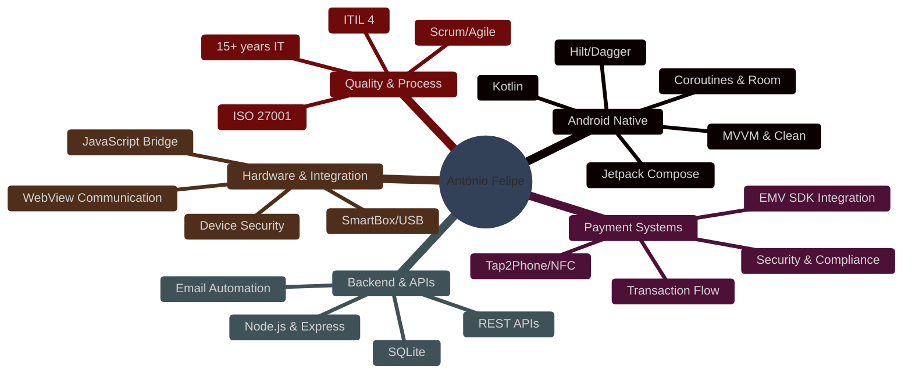

<div align="center">
  
</div>

<br>

<div align="center">
  
  [](https://git.io/typing-svg)

</div>

<br>

<div align="center">
  <a href="https://www.linkedin.com/in/id-antonio-felipe" target="_blank">
    
  </a>
  <a href="mailto:afelipe.pt@outlook.com">
    
  </a>
  <a href="https://github.com/afoliveira111">
    
  </a>
  
</div>

<br>

---

<br>

## 👨‍💻 About Me

<table>
<tr>
<td width="50%">

```kotlin
data class Developer(
    val name: String = "António Felipe Aguiar de Oliveira",
    val role: String = "Android Developer",
    val location: String = "Coimbra, Portugal 🇵🇹",
    val experience: String = "3+ years Android | 15+ years IT",
    val specialization: List<String> = listOf(
        "Native Android (Kotlin)",
        "EMV/Tap2Phone Payments",
        "Hardware Integration",
        "WebView & JavaScript Bridge",
        "Backend APIs (Node.js)"
    ),
    val currentFocus: String = "Spotside - EMV Payment Systems",
    val philosophy: String = "Security, stability and real business impact"
)
```

</td>
<td width="50%">

### 🎯 Core Expertise

- 📱 **Android Native**: Kotlin, MVVM, Clean Architecture
- 💳 **EMV Payments**: Tap2Phone, NFC, Wizzit/Unicre SDK  
- 🔌 **Hardware**: SmartBox/USB, Device Communication
- 🌐 **WebView Integration**: JavaScript Bridge
- 🔒 **Security**: ProGuard, FLAG_SECURE, Anti-repackaging
- 🖥️ **Backend**: Node.js, Express, REST APIs, SQLite

### 📊 Background

- 15+ years in IT (Infrastructure, Quality, Process Analysis)
- Certified: ISO 27001, ITIL 4, Azure, Microsoft 365
- Strong focus on real-world business solutions

</td>
</tr>
</table>

<br>

---

<br>

## 🛠️ Technology Stack

<div align="center">

### 📱 Android Development


### 🏗️ Architecture & Patterns


### 📚 Libraries & Tools


### 💳 Payments & Integration


### 🖥️ Backend & Web


### 🛠️ Tools & Security


### 📋 Methodologies & Certifications


</div>

<br>

---

<br>

## 📊 GitHub Statistics

<div align="center">
  
  
</div>

<div align="center">
  
  
</div>

<br>

<div align="center">
  
</div>

<br>

---

<br>

## 💼 Professional Highlights

<div align="center">

<table>
<tr>
<td width="50%">

### 💳 Spotside - EMV Payment System
**Android Developer | Dez 2024 - Presente**

Sistema completo de pagamentos Tap2Phone/EMV para máquinas de vending:
- Integração SDK Wizzit/Unicre certificado
- NFC, ciclo EMV completo, reembolsos
- JavaScript Bridge WebView ↔ Native
- Segurança: ProGuard, FLAG_SECURE
- Hardware: SmartBox/USB integration

`Kotlin` `EMV` `NFC` `WebView` `Security`

</td>
<td width="50%">

### 📱 DevSpace - Mobile Apps
**Android Developer | Jan 2023 - Dez 2024**

Aplicações Android enterprise com arquitetura escalável:
- MVVM & Clean Architecture
- Coroutines, Room, Retrofit, Hilt
- Testes unitários e otimização
- Ciclos ágeis e Clean Code

`Kotlin` `MVVM` `Coroutines` `Testing`

</td>
</tr>
<tr>
<td width="50%">

### 🗓️ Essência BL - Booking System
**Fullstack Developer | Nov 2025 - Presente**

Sistema de gestão de agendamentos:
- Backend Node.js + Express + SQLite
- REST API com validações complexas
- Automação email (Nodemailer)
- Interface admin e backups

`Node.js` `Express` `SQLite` `API`

</td>
<td width="50%">

### 📊 Montreal - Process & Quality
**Analyst | Jan 2021 - Jun 2024**

Análise e monitorização de sistemas críticos:
- Petróleo & Gás, ambientes críticos
- SLA, OLA, KPI management
- SCRUM, ITIL, documentação técnica
- Coordenação de equipas

`ITIL` `SCRUM` `Quality` `SLA`

</td>
</tr>
</table>

</div>

<br>

---

<br>

## 💡 Key Skills Summary



<br>

---

<br>

## 🎓 Certifications & Education

<div align="center">


**Licenciatura em Redes de Computadores** | Universidade Estácio | 2009-2011

**Idiomas:** Português (Nativo) | Inglês (B2 - Profissional)

</div>

<br>

---

<br>

## 💬 Get In Touch

<div align="center">

### Let's discuss your next mobile project! 🚀

<p>Specialized in Android native development, payment integrations, and secure mobile solutions.</p>

<a href="https://www.linkedin.com/in/id-antonio-felipe">
  
</a>
<a href="mailto:afelipe.pt@outlook.com">
  
</a>

<br><br>


</div>

<br>

---

<div align="center">
  
### ⭐ From [afoliveira111](https://github.com/afoliveira111) with 💙

*"Security, stability, and real business impact — one line of code at a time."*

</div>


